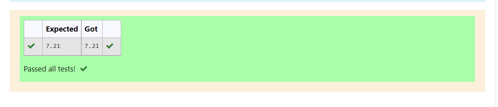

# DISTANCE-BETWEEN-TWO-POINTS

## AIM:
To write a python program to find the distance two 2 points
## ALGORITHM:
### Step 1: 
Import numpy into the editor
### Step 2: 
Input the co-ordinates to calculate the distance between them.
### Step 3: 
Substitute the values in the distance formula 

 
### Step 4: 
Print the solution.
### Step 5: 
End the program.

### PROGRAM:
~~~
#Program to find the distance between two points.
#Developed by: Suwetha M
#RegisterNumber: 21006216
x1,x2=10,6
y1,y2=4,2
import math
value=math.sqrt((x2-x1)**2+(y2-y1)**2)
print("{:.2f}".format(value))
~~~
### OUTPUT:

### RESULT:
The distance between the two points is displayed sucessfully.